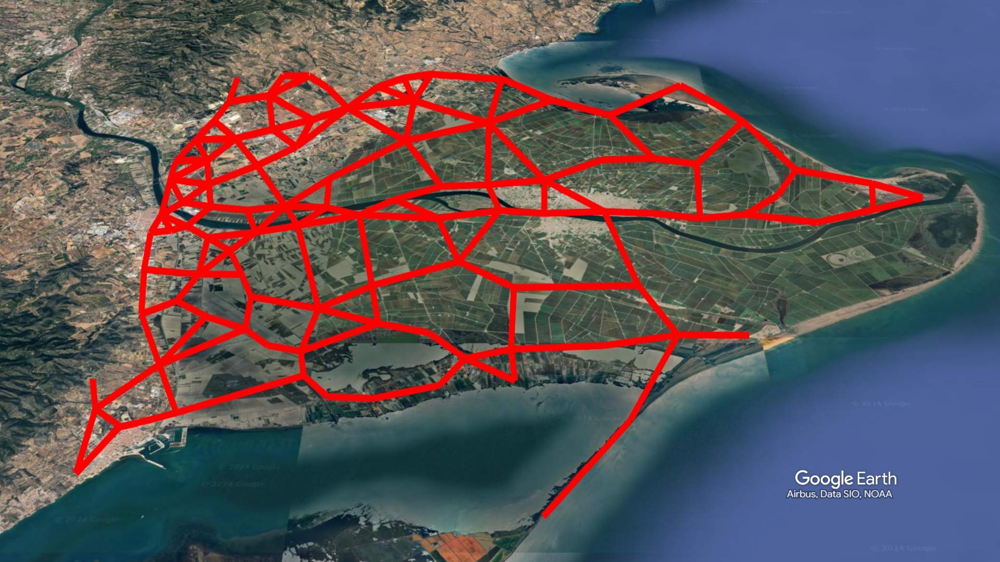
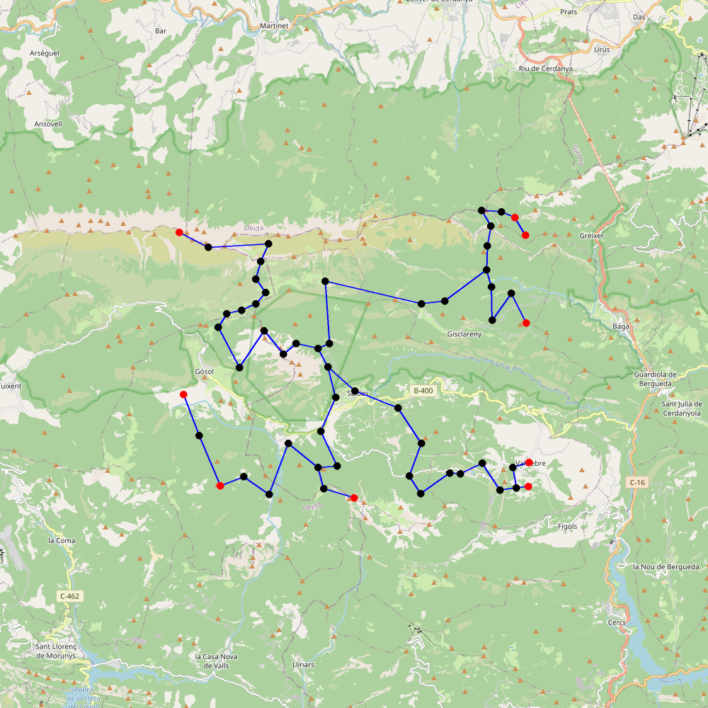
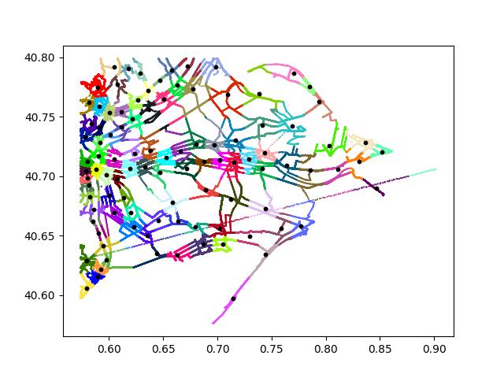
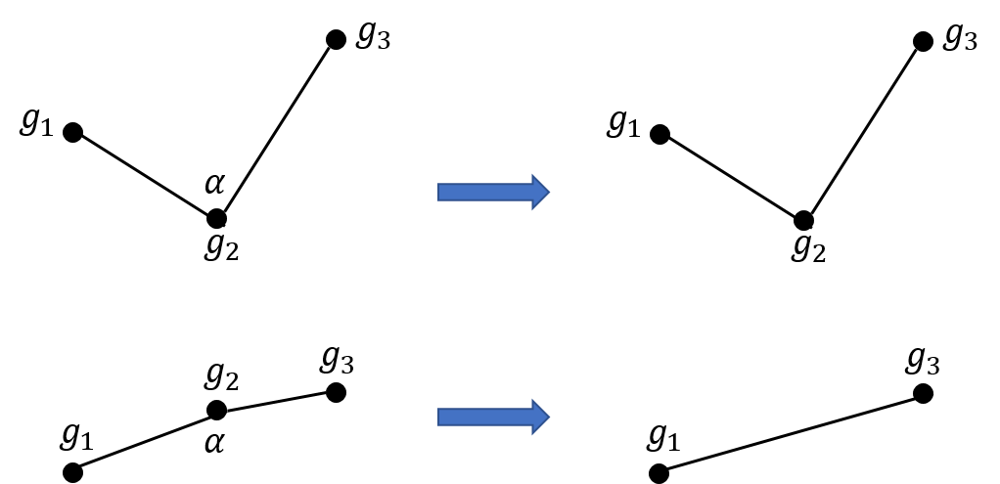
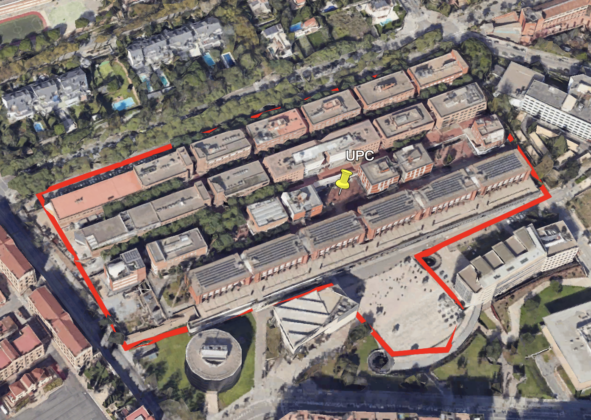

# Pràctica GCED-AP2 2024 · Rutes i monuments

En aquesta pràctica, tindreu l'oportunitat d'inferir mapes a partir de trajectòries GPS obtingudes per senderistes, visualitzar-les en 3D, i trobar rutes òptimes per arribar a edificacions medievals com ara ermites i castells.

El vostre programa ha de:

- Obtenir les rutes dels senderistes en una regió geogràfica.
- Inferir un mapa (un graf) a partir de les rutes.
- Obtenir les coordenades de monuments medievals.
- Trobar rutes òptimes per arribar a monuments medievals en el graf inferit.
- Visualitzar els mapes resultants en 2D i 3D.

Les dades s'obtindran a través de [OpenStreetMap](https://www.openstreetmap.org/) i de [Catalunya Medieval](https://www.catalunyamedieval.es/).

Aquí teniu un exemple de visualització d'un mapa en 3D obtingut amb les rutes pel Delta de l'Ebre:



Aquí teniu un exemple de visualització de les rutes òptimes per arribar a tots els monuments medievals al voltant del Pedraforca:



## Descobrint les rutes dels senderistes

Els mapes es representaran com grafs _no dirigits_ on els nodes correspondran a posicions geogràfiques i les arestes representaran trams de rutes entre posicions.

En el treball haurem d'identificar una regió de la nostra geografia mitjançant les coordenades geogràfiques (latitud i longitud) dels extrems d'un rectangle. Per exemple, per identificar el delta de l'Ebre podríem triar les coordenades:

> Longitud: left = 0.5739316671, right = 0.9021482
>
> Latitud: bottom = 40.5363713, top = 40.79886535

Hi ha múltiples treballs de recerca que han proposat diferents estratègies per construir aquest tipus de mapes. Entre ells, podem destacar-ne un realitzat a la UPC:

> D. Duran, V. Sacristán, R.I. Silveira, [Map construction algorithms: a local evaluation through hiking data](https://doi.org/10.1007/s10707-019-00386-7), Geoinformatica (2002) 24:633-681.

### Les dades

Quan fem senderisme, podem emmagatzemar les rutes en un arxiu [GPX](https://www.topografix.com/gpx.asp) fent servir un dispositiu amb geolocalització (telèfon mòbil, rellotge, etc) a través del sistema GPS. En un arxiu GPX podem representar una senda com una seqüència de punts ordenats en el temps, per exemple:

| Temps                | Latitud     | Longitud      |
| -------------------- | ----------- | ------------- |
| 2020-08-20T22:46:10Z | 53.89354394 | -122.82148698 |
| 2020-08-20T22:46:11Z | 53.89354093 | -122.82148961 |
| ...                  | ...         | ...           |

Les nostres dades s'obtindran de repositoris d'arxius GPX que podran ser seleccionats definint la nostra regió d'interès.

### Agrupació de punts

Com que disposarem d'una gran quantitat de punts geolocalitzats, farem una agrupació (clustering) per a identificar un subconjunt de punts representatius de les sendes analitzades. Podem utilizar algun dels algorismes d'agrupació per a calcular grups com els que es mostren a la figura. Es pot veure com uns quants centenars de punts han estat agrupats en 8 grups. Cada grup està representat pel seu centroid (el triangle al mig de cada grup). Aquests centroids seran els nodes del graf que representarà el mapa.


Quants grups haurà de tenir el mapa? Aquest serà un paràmetre de l'algorisme per crear mapes. A la figura es mostra l'agrupament obtingut a partir de diverses sendes del Delta de l'Ebre usant 100 grups. Els punts negres de la figura representen els centroids dels grups.



**Suggeriment:** no implementeu l'algorisme d'agrupament. Podeu fer servir el que ja existeix en algunes llibreries ([K-means](https://scikit-learn.org/stable/modules/generated/sklearn.cluster.KMeans.html)).

### Les arestes del graf

Els nodes del graf _no dirigit_ són els centroids dels grups. I les arestes? Molt senzill. Les sendes són seqüències de punts geogràfics $(p_1, p_2, \ldots, p_n)$. Suposarem que els punts adjacents de les seqüencies estan connectats, per exemple: $p_1 - p_2 -\ldots- p_n$.
Si suposem que els grups són conjunts de punts, llavors connectarem dos grups $g_i-g_j$ si existeixen dos punts geogràfics connectats en una senda, $p_k-p_{k+1}$, tals que $p_k \in g_i$ i $p_{k+1} \in g_j$, sempre i quan $g_i\neq g_j$.

Ara ja tenim el graf!

### Simplificació del graf

El graf pot mostrar una estructura que es pot simplificar sense perdre gaire informació rellevant. Per exemple, imaginem tres grups connectats per dues arestes: $g_1-g_2-g_3$. Si $g_2$ només té dues arestes i l'angle $\measuredangle g_1g_2g_3$ és proper a $180^o$, llavors $g_2$ es podria eliminar creant l'aresta $g_1-g_3$. A la figura següent és mostren dos exemples. En el primer, l'angle $\alpha$ és massa diferent de $180^o$ i, per tant, no es pot aplicar la simplificació. En el segon cas es pot eliminar $g_2$.



La simplifiació la podem formalitzar de la manera següent. Donats tres grups $g_1-g_2-g_3$, eliminarem $g_2$ si es donen aquestes tres condicions:

- $g_2$ només té dues arestes connectades
- L'angle $\alpha=\measuredangle g_1g_2g_3$ és proper a $180^o$, és a dir, $|180^o-\alpha| < \varepsilon$, on $\varepsilon$ és un paràmetre de l'algorisme (mesurat en graus).

### Visualització del graf

De res serveix tenir un mapa a la memòria de l'ordinador si no el podem visualitzar. Ens interessa generar un arxiu gràfic (en format PNG) per visualitzar la informació inferida de les rutes analitzades. Per això, podem fer servir [staticmap](https://github.com/komoot/staticmap/blob/master/README.md) per dibuixar els nodes i arestes del graf amb el mapa real al fons.

**Comentari:** Aquí caldria posar una figura 2D d'exemple, mostrant el tipus de visualització que s'espera. Podria ser la mateixa que la de la introducció.

Igualment, ens interessa poder veure el graf creat en un sistema de visualització 3D. Per això, cal que creu un fitxer KML amb les coordenades dels nodes i les arestes del graf. Aquest fitxer KML es pot visualitzar fàcilment amb [Google Earth](https://earth.google.com/web).

**Comentari:** Aquí caldria posar una figura 3D d'exemple, mostrant el tipus de visualització que s'espera. Podria ser la mateixa que la de la introducció.

### Benvinguts al món real: les dades no són perfectes, s'han de cuinar

Probablement observareu anomalies en la visualització de les dades que generen mapes poc intuitius. Per exemple, pot aparèixer una aresta que vagi per sobre d'un llac. Això pot ser degut a diverses causes:

- És possible que, en una determinada ruta, el GPS perdi la connexió durant uns minuts i és generin dos punts consecutius molt allunyats.

- És possible que la seqüència de temps estigui mal ordenada a l'arxiu GPX, és a dir, que temps($p_i$) $>$ temps($p_{i+1}$) en una determinada seqüència.

- És possible que obtinguem grafs amb més d'un component connex. Penseu com evitar problemes a l'hora de calcular les rutes.

En el cas de detectar anomalies, caldrà fer una feina de _neteja_ de dades. Una opció és ignorar aquelles dades que mostren anomalies, o corregir l'anomalia fent alguna suposició raonable (per exemple, una interpolació). Qualsevol decisió que prengueu per netejar les dades haurà d'estar raonada i documentada en la documentació lliurada amb la pràctica.

## Rutes òptimes per arribar a monuments medievals

Un cop tenim el mapa de les rutes dels senderistes, podem utilitzar-lo per trobar rutes òptimes per arribar a tots els monuments medievals des d'un punt de partida donat.

### Les dades

Per aquesta part de la pràctica, usarem les dades disponbles a [Catalunya Medieval](https://www.catalunyamedieval.es/). Aquesta pàgina web conté informació sobre més de 1000 monuments medievals de Catalunya organitzats en pàgines segons el seu tipus (edificacions militars, religioses,...) i subtipus (castells, muralles, torres,...). Cada fitxa conté la informació bàsica del monument, de la qual ens interessa el seu nom i les seves coordenades.

### Càlcul de les rutes

A partir d'un punt de partida donat (origen), cal calcular l'arbre de rutes més curtes que van des de l'origen a cadascun dels monuments mediavals de la regió. El resultat hauria de ser un mapa com aquest (però usant staticmap), on les distàncies es calculen a partir de les distàncies en línia recta de les arestes del graf.


Com que ni l'origen ni la posició dels monuments coincidiran amb els nodes del graf, el mapa s'aproximarà amb els nodes del graf que estan més propers a les posicions de l'origen i dels monuments.

## Esquelet proposat

A continuació es proposa un esquelet per la vostra aplicació. Podeu utilitzar-lo com a guia, però no cal que el seguiu estrictament. Els tipus es defineixen com a classes, però utilitzeu altres tipus de Python com llistes, tuples o dataclasses si ho considereu més convenient.

### mòdul `segments.py`

```python3

from typing import TypeAlias

@dataclass
class Point:
    lat: float
    lon: float

@dataclass
class Segment:
    start: Point
    end: Point

class Box:
    bottom_left: Point
    top_right: Point

Segments: TypeAlias = list[Segment]

def download_segments(box: Box, filename: str) -> None:
    """Download all segments in the box and save them to the file."""

def load_segments(filename: str) -> Segments:
    """Load segments from the file."""

def get_segments(box: Box, filename: str) -> Segments:
    """
    Get all segments in the box.
    If filename exists, load segments from the file.
    Otherwise, download segments in the box and save them to the file.
    """

def show_segments(segments: Segments, filename: str) -> None:
    """Show all segments in a PNG file using staticmap."""

```

### mòdul `graphmaker.py`

```python3

import networkx as nx

def make_graph(segments: Segments, clusters: int) -> nx.Graph:
    """Make a graph from the segments."""

def simplify_graph(graph: nx.Graph, epsilon: float) -> nx.Graph:
    """Simplify the graph."""
```

### mòdul `viewer.py`

```python3


def export_PNG(graph: nx.Graph, filename: str) -> None:
    """Export the graph to a PNG file using staticmap."""


def export_KML(graph: nx.Graph, filename: str) -> None:
    """Export the graph to a KML file."""


```

### mòdul `monuments.py`

```python3

@dataclass
class Monument:
     name: str
     location: Point

Monuments: TypeAlias = list[Monument]

def download_monuments() -> Monuments:
    """Download monuments from Catalunya Medieval."""

def load_monuments(filename: str) -> Monuments:
    """Load monuments from a file."""

def get_monuments(filename: str) -> Monuments:
    """
    Get all monuments in the box.
    If filename exists, load monuments from the file.
    Otherwise, download monuments and save them to the file.
    """


```

### mòdul `routes.py`

```python3

class Routes:

def find_routes(graph: nx.Graph, start: Point, endpoints: Monuments) -> Routes:
    """Find the shortest route between the starting point and all the endpoints."""


def export_PNG(routes: Routes, filename: str) -> None:
    """Export the graph to a PNG file using staticmap."""


def export_KML(groutes: Routes, filename: str) -> None:
    """Export the graph to a KML file."""
```

### mòdul `main.py`

Llegeix les entrades, pregunta què fer i crida les funcions adequades.

## Llibreries

Utilitzeu les llibreries de Python següents:

- `requests` per baixar-vos fitxers de dades.
- `gpxpy` per llegir fitxers GPX.
- `beatifulsoup` per llegir arbres HTML.
- `simplekml` per escriure fitxers KML.
- `networkx` per a manipular grafs.
- `scikit` per calcular agrupaments.
- `haversine` per a calcular distàncies entre coordenades.
- `staticmap` per pintar mapes.

Totes es poden instal·lar amb `pip3 install`.

Podeu utilitzar lliurement altres llibreries estàndards de Python. Si voleu usar llibreries no estàndard, heu de demanar permís als vostres professors (que segurament no us el donaran).

A més, useu [Google Earth](https://earth.google.com/web) per carregar els fitxers KML i veure'ls en 3D. Només cal picar Fitxer ➡ Import KML.

## Fonts d'informació

Aquests enllaços us seran útils per fer el vostre projecte:

- [Lliçons de fitxers en Python](https://lliçons.jutge.org/python/fitxers-i-formats.html)

- [Tutorial de NetworkX](https://networkx.github.io/documentation/stable/tutorial.html)

- [Tutorial de Requests](https://realpython.com/python-requests/)

- [Documentació de BeautifulSoup](https://www.crummy.com/software/BeautifulSoup/bs4/doc/)

- [Documentació de simplekml](https://simplekml.readthedocs.io/en/latest/)

- [Documentació de haversine](https://pypi.org/project/haversine/)

- [Documentació de gpxpy](https://github.com/tkrajina/gpxpy)

## Indicacions

### Com obtenir segments de rutes a OpenStreetMaps

El codi següent es connecta a OpenStreetMap per obtenir totes les rutes disponibles al Delta de l'Ebre i mostrar-ne tots els segments existents.

```python3
import requests
import gpxpy

BOX_EBRE = "0.5739316671,40.5363713,0.9021482,40.79886535"

page = 0

while True:
    url = f"https://api.openstreetmap.org/api/0.6/trackpoints?bbox={BOX_EBRE}&page={page}"
    response = requests.get(url)
    gpx_content = response.content.decode("utf-8")
    gpx = gpxpy.parse(gpx_content)

    if len(gpx.tracks) == 0:
        break

    for track in gpx.tracks:
        for segment in track.segments:
            if all(point.time is not None for point in segment.points):
                segment.points.sort(key=lambda p: p.time)  # type: ignore
                for i in range(len(segment.points) - 1):
                    p1, p2 = segment.points[i], segment.points[i + 1]
                    print(p1.latitude, p1.longitude, p1.time, "-", p2.latitude, p2.longitude, p2.time)
    page += 1
```

Compte: els segments de les rutes d'OSM estan compostos de molts punts, mentre que els `Segments` de la nostra aplicació només tenen dos punts.

### Com processar arbres HTML amb `BeautifulSoup`

El codi següent mostra com llegir una pàgina web amb `beautifulsoup` per obtenir tots els noms i enllaços a les ermites de Catalunya Medieval:

```python
from bs4 import BeautifulSoup
import requests

url = "https://www.catalunyamedieval.es/edificacions-de-caracter-religios/ermites/"
response = requests.get(url)
soup = BeautifulSoup(response.content, "html.parser")
ermites = soup.find_all("li", class_="ermita")
for ermita in ermites:
    link = ermita.find("a")
    print(link.get("href"), link.text)
```

El resultat és quelcom com:

```
https://www.catalunyamedieval.es/capella-de-cal-casalets-solsona-solsones/ 1. Capella de Cal Casalets  – Solsona / Solsonès
https://www.catalunyamedieval.es/capella-de-calders-sant-gregori-girones/ 2. Capella de Calders – Sant Gregori / Gironès
https://www.catalunyamedieval.es/capella-de-can-cama-masies-de-voltrega-osona/ 3. Capella de Can Camà (*) – Masies de Voltregà / Osona
https://www.catalunyamedieval.es/capella-de-can-font-de-la-serra-manresa-bages/ 4. Capella de Can Font de la Serra – Manresa / Bages
...
```

Compte! Penseu que haureu d'accedir a molts links, així que és possible que es produeixin errors...

### Com generar un fitxer KML amb `simplekml`

El codi següent mostra com generar un fitxer KML amb `simplekml` que conté un punt i una ruta pel Campus Nord de la UPC:

```python
import simplekml

kml = simplekml.Kml()

kml.newpoint(name="UPC", coords=[(2.112347, 41.388725)])

lin = kml.newlinestring(
    name="Camí",
    description="Un caminet per la UPC",
    coords=[
        (2.11117435152314, 41.3872344661771),
        (2.112543023293298, 41.38807192338636),
        (2.113186629350088, 41.3877564559475),
        (2.113580383823295, 41.38790501339351),
        (2.113638683576819, 41.38819670380168),
        (2.113130671445338, 41.3884676474094),
        (2.114012520479633, 41.38919524414038),
        (2.112873821172967, 41.39003242064307),
        (2.109970958003426, 41.38801346749829),
        (2.11117435152314, 41.3872344661771),
    ],
)
lin.style.linestyle.color = "ff0000ff"  # Red
lin.style.linestyle.width = 5

kml.save("upc.kml")
```

El resultat és el fitxer [upc.kml](upc.kml) que podeu obrir amb Google Earth per veure quelcom com això:



Fixeu-vos que els arbres i edificis poden tapar la vista dels camins. Podeu canviar l'altitud dels punts i línies per aixecar-los per sobre dels arbres i edificis afegint una tercera coordenada d'altitud als punts i línies.

# Instruccions

## Equips

Podeu fer aquest projecte sols o en equips de dos. En cas de fer-lo en equip, la càrrega de treball dels dos membres de l'equip ha de ser semblant i el resultat final és responsabilitat d'ambdós. Cada membre de l'equip ha de saber què ha fet l'altre membre. Ambdós membres són responsables de tot el treball.

Els qui decidiu fer el segon projecte en un equip de dos estudiants, envieu abans de les 23:59 del dia 1 de maig un missatge al professor Jordi Petit amb aquestes característiques:

- des del compte oficial (`@estudiantat.upc.edu`) del membre amb l'email més baix (segons l'ordre lexicogràfic),
- amb tema (subject) "Equips AP2 2024",
- amb el nom dels dos estudiants de l'equip al cos del missatge,
- fent còpia (CC) al email del compte oficial de l'altre estudiant.

Si no es rep cap missatge d'equip per aquesta data, es considerarà que feu la pràctica sols (i no us podreu "aparellar" més tard). Si heu enviat aquest missatge, es considerarà que feu la pràctica junts (i no s'admetràn "divorcis").

## Lliurament

Heu de lliurar la vostra pràctica al Racó.
El termini de lliurament és el **dimarts 4 de juny a les 23:59 CEST**.

Només heu de lliurar un fitxer ZIP que, al descomprimir-se, generi en el directori actual els fitxers següents:

- `README.md` amb la documentació del projecte (incloent els noms dels autors),
- `requirements.txt` amb el requeriments del vostre projecte,
- `*.py`: els vostres moduls en Python,
- `segments.dat`: un exemple de dades de segments,
- `monuments.dat`: les dades dels monuments medievals,
- `*.png` amb imatges per a la documentació.

Res més. Sense directoris ni subdirectoris. Ni `.gits`, ni `._*`. Res més, gràcies.

Els vostres fitxers de codi en Python han de seguir
[les regles d'estil PEP8](https://www.python.org/dev/peps/pep-0008/). Podeu utilitzar el paquet `pycodestyle` per assegurar-vos que seguiu aquestes regles d'estil. També existeix una extensió de Visual Studio Code, anomenada [Black Formatter](https://marketplace.visualstudio.com/items?itemName=ms-python.black-formatter), que permet [formatar el codi automàticament](https://code.visualstudio.com/docs/python/formatting) amb el format descrit al PEP8. L'ús de tabuladors en el codi queda prohibit (zero directe).

Els vostres programes en Python han d'usar `typing` en la mesura del possible. Totes les funcions públiques han d'incloure el tipus dels seus paràmetres i resultats.

El projecte ha de contenir un fitxer `README.md` que el documenti. Vegeu, per exemple, https://gist.github.com/PurpleBooth/109311bb0361f32d87a2.

El projecte també ha de contenir un fitxer `requirements.txt` amb les llibreries que utilitza el vostre projecte per poder-lo instal·lar. És tant senzill com escriure cada dependència en una línia. Per més informació vegeu, per exemple, https://pip.pypa.io/en/stable/user_guide/#requirements-files. No indiqueu les versions.

## Consells

- Documenteu el codi a mesura que l'escriviu.

- L'enunciat deixa obertes moltes qüestions intencionadament. Sou els responsables de prendre les vostres decisions de disseny i deixar-les reflectides adientment al codi i a la documentació.

- Considereu que el projecté és la primera versió d'una aplicació que hareu d'anar millorant en els propers anys. Eviteu valors màgics, useu constants, definiu funcions per a càlculs suceptibles de ser reconsiderats el futur...

- Podeu ampliar les capacitats del vostre projecte mentre mantingueu les funcionalitats mínimes previstes en aquest enunciat. Ara bé, aviseu abans als vostres professors i deixeu-ho tot ben documentat.

- Per evitar problemes de còpies, no pengeu el vostre projecte en repositoris públics.

- Programeu poc. Penseu molt.

## Autors

- Laia Mogas
- Jordi Cortadella
- Pau Fernández
- Jordi Petit

Universitat Politècnica de Catalunya, 2024
